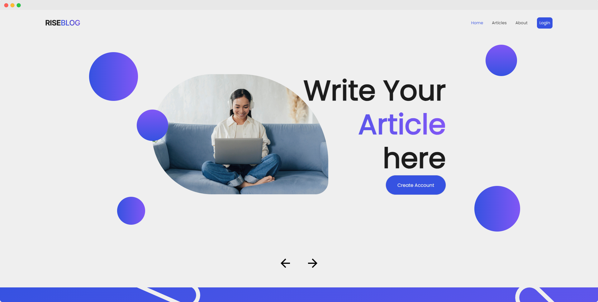
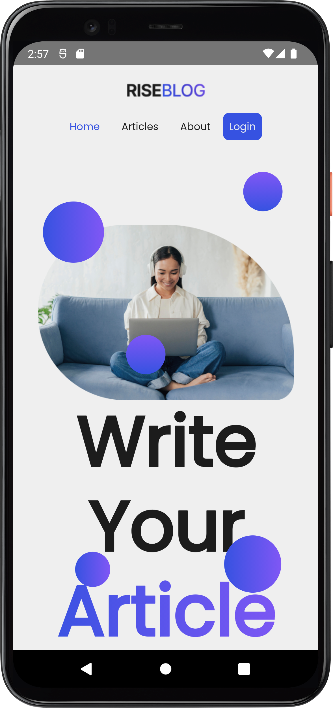

# RISEBLOG

It is a blog with the Vue JS and capasitor (android). It is using the dummyapi.io a dummy API public. Thanks to Fadh for the UI/UX, here is the [design](https://www.figma.com/community/file/1230503106556871788).

Access the Website [riseblog.vercel.app](riseblog.vercel.app) and Get the apk [here](./android/app/release/app-release.apk) or access the android/app/release folder and download the app-release.apk

## Project Screenshots

**Website** 
 

**Mobile** 
